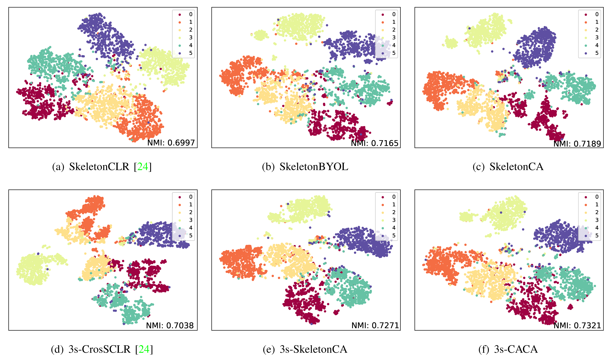

# 3s-CACA

This is an official PyTorch implementation of **"Self-Supervised Action Recognition by Cross-Model Adversarial and Cross-Stream Aggregation" **. 


## Requirements
      

## Data Preparation
- Download the raw data of [NTU RGB+D](https://github.com/shahroudy/NTURGB-D) and [PKU-MMD](https://www.icst.pku.edu.cn/struct/Projects/PKUMMD.html).
- For NTU RGB+D dataset, preprocess data with `tools/ntu_gendata.py`. For PKU-MMD dataset, preprocess data with `tools/pku_part1_gendata.py`.
- Then downsample the data to 50 frames with `feeder/preprocess_ntu.py` and `feeder/preprocess_pku.py`.
- If you don't want to process the original data, download the file folder in Google Drive [action_dataset](https://drive.google.com/drive/folders/1VnD3CLcD7bT5fMGI3tDGPlcWZmBbXS0m?usp=sharing) or BaiduYun link [action_dataset](https://pan.baidu.com/s/1NRK1ksRHgng_NkOO1ZYTcQ), code: 0211. NTU-120 is also provided: [NTU-120-frame50](https://drive.google.com/drive/folders/1dn8VMcT9BYi0KHBkVVPFpiGlaTn2GnaX?usp=sharing).

## Installation
  ```bash
# Install torchlight
$ cd torchlight
$ python setup.py install
$ cd ..
  
# Install other python libraries
$ pip install -r requirements.txt
  ```

## Unsupervised Pre-Training and Linear Evaluation

Example for unsupervised pre-training and linear evaluation of **3s-CACA**. You can change some settings of `.yaml` files in `config/three_streams/dataset` folder. More examples refer to `run.sh`.
```bash
# train on NTU RGB+D xsub (three-stream)
$ python main.py pretrain_skeleton_3views --config config/three_streams/ntu60_cs/pretext_caca_3views_xsub_cross_2_10.yaml
$ python main.py linear_evaluation_3views --config config/three_streams/ntu60_cs/linear_eval_caca_3views_xsub_cross_2_10.yaml

# train on NTU RGB+D xsub (joint-stream)
$ python main.py pretrain_skeleton --config config/single_stream/stgcn/ntu60_cs/pretext/pretext_caca_512_2048_512_2048_0.996_joint.yaml
$ python main.py linear_evaluation --config config/single_stream/stgcn/ntu60_cs/linear_eval/linear_eval_caca_512_2048_512_2048_0.996_joint.yaml
```

## Trained models

We release several trained models in [released_model](https://drive.google.com/drive/folders/1bloxplhoIn46OC52sUtEmAOcm3TxO3Qq?usp=sharing). You can download them, put them in `model` and test them with linear evaluation by changing `weights` in `.yaml` files.

|     dataset     | Linear Evaluation (%) |
| :-------------: | :-------------------: |
|   NTU-60 xsub   |         78.57         |
|   NTU-60 xsub   |         84.50         |
|  NTU-120 xsub   |         68.54         |
|  NTU-120 xset   |         71.10         |
| PKU-MMD part I  |         88.05         |
| PKU-MMD part II |         53.48         |

## Visualization

The [**t-SNE**](https://www.jmlr.org/papers/volume9/vandermaaten08a/vandermaaten08a.pdf) visualization of the embeddings after pre-training on NTU60-xview.




## Citation
Please cite our paper if you find this repository useful in your resesarch:

```
@inproceedings{guo2022aimclr,
  Title= {Contrastive Learning from Extremely Augmented Skeleton Sequences for Self-supervised Action Recognition},
  Author= {Tianyu, Guo and Hong, Liu and Zhan, Chen and Mengyuan, Liu and Tao, Wang  and Runwei, Ding},
  Booktitle= {AAAI},
  Year= {2022}
}
```

## Acknowledgement
The framework of our code is extended from the following repositories. We sincerely thank the authors for releasing the codes.
- The framework of our code is based on [CrosSCLR](https://github.com/LinguoLi/CrosSCLR) and [AimCLR](https://github.com/Levigty/AimCLR).
- The encoder is based on [ST-GCN](https://github.com/yysijie/st-gcn/blob/master/OLD_README.md).

## Licence

This project is licensed under the terms of the MIT license.